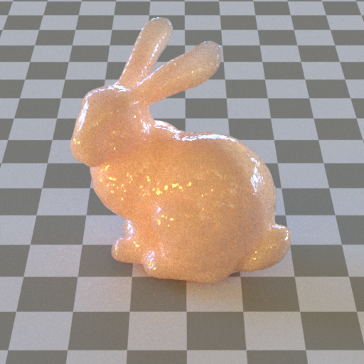
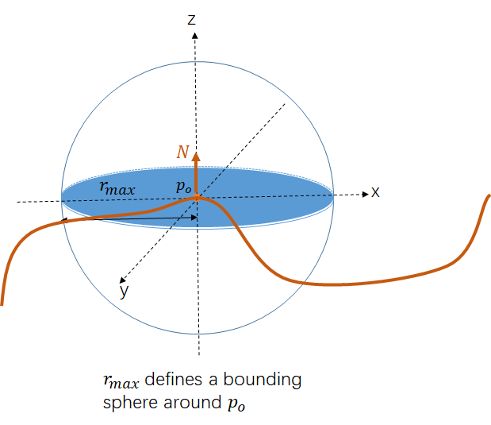
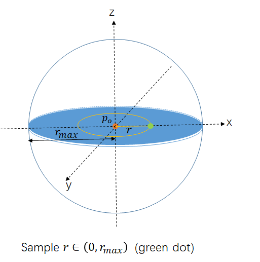
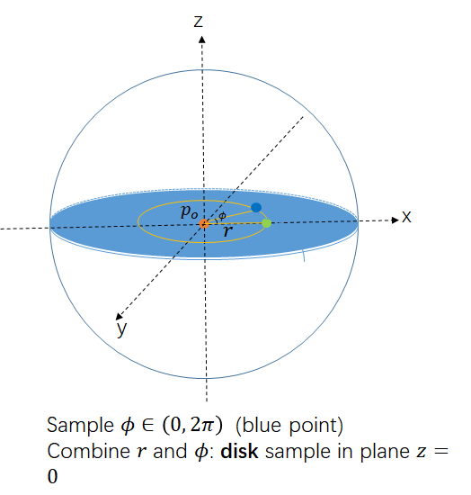
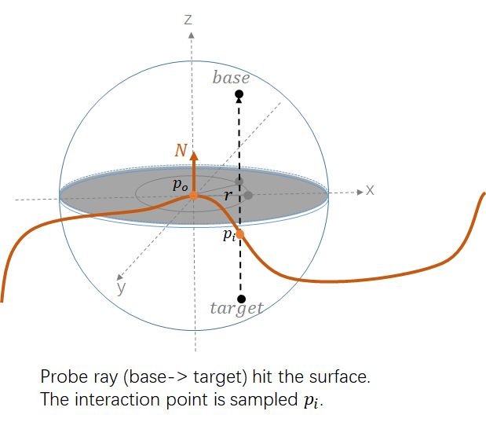
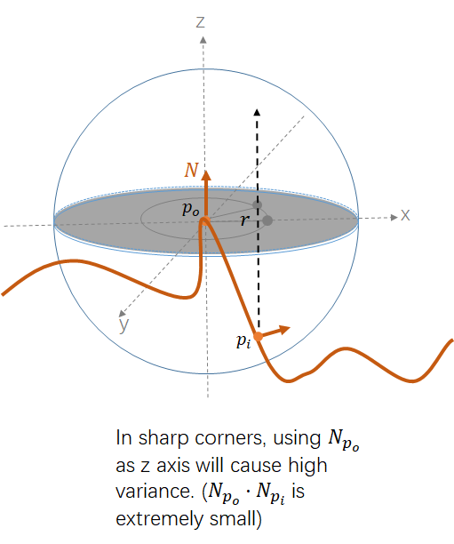
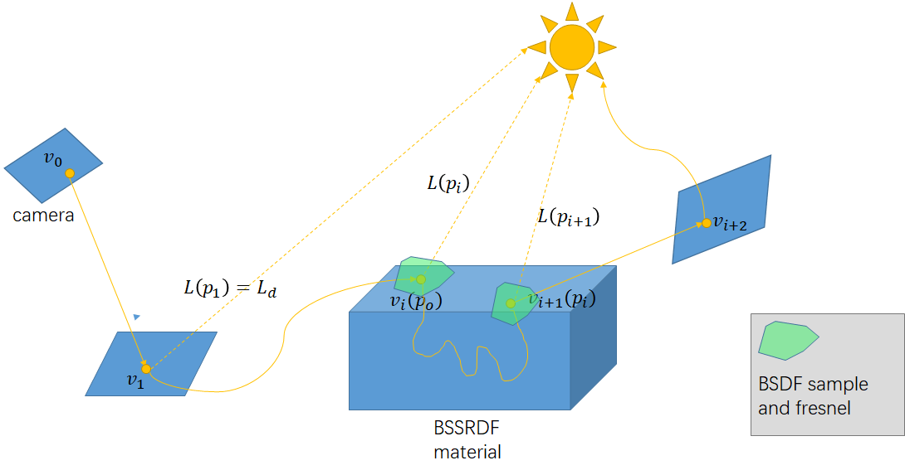

# BSSRDF

> Duan gao

|  |
| :----------------------------------------------------------: |
| Bunny rendered by my own renderer [Elegans](https://github.com/gao-duan/Elegans). |

BSSRDF aims to simulate volume scatterings using simplified assumption.
$$
S(p_o, \omega _o, p_i, \omega_i)
$$
## Separate BSSRDF

Split the BSSRDF into 3 parts: ([Eq 11.7](http://www.pbr-book.org/3ed-2018/Volume_Scattering/The_BSSRDF.html#eq:separable-bssrdf-directional) in PRRT-v3)
$$
S(p_o, \omega_o, p_i, \omega_i) = \frac{1}{\pi}(1-F(\omega_o)) S_p (p_o,p_i) S_\omega(\omega_i)
$$

$$
S_\omega(\omega_i) = \frac{1-F(\omega_i)}{c}
$$

>  About c (normalized factor),
> $$
> \int_\Omega S_w(w_i) cos\theta d\omega_i = 1 \\
> c = \int_{0}^{2\pi} \int_0^{\pi/2} {(1-F(cos\theta))} sin\theta cos\theta d\theta d\phi
> $$
> 

> And assume the $S_p$ is only related to $||p_o - p_i||$: 
> $$
> S_p(p_o, p_i) = S_r(||p_o - p_i||)
> $$


And the render equation:
$$
\begin{align*}
L_o(p_o,\omega_o) =& \int_A\int_{\Omega} S(p_o, \omega_o, p_i, \omega_i) L_i(p_i, \omega_i) |cos\theta_i| d\omega_i dA(p_i) \\
 = & (1-F(\omega_o)) \int_A S_p(p_o,p_i) \int_\Omega S_\omega(\omega_i) L_i(p_i,\omega_i) |cos\theta_i| d\omega_i dA(p_i) 
\end{align*}
$$

Next I will introduce $S_r$ of normalized diffusion BSSRDF model and how to important sampling this BSSRDF.


## Normalized diffusion BSSRDF

The key idea is using Exp function to approximate $S_r$ (including single-scattering and multiple-scattering).

- $S_r$ formula (using mean free path $l$ as parameter )

  From equation 3 in [1], 

  > - change $A$ to $\rho_{eff}$, because $A$ in dipole diffusion represents the internal reflection parameter;
  >
  >  - $\rho_{eff}$ represents effective albedo, which is described in PBRT-v3 [eq 11.11](http://www.pbr-book.org/3ed-2018/Volume_Scattering/The_BSSRDF.html#eq:bssrdf-effective-albedo))

  $$
  S_r(r) = \rho_{eff} s \frac{e^{-sr/l} + e^ {-sr/(3l)}}{8\pi lr}
  $$
  where $r$ is the distance between $p_o$ and $p_i$,  $s$ is scale factor and $l$ is mean free path length.

- Another formula (using diffuse mean free path $l_d$ as parameter)

  Compute $l_d$ and $s$ from physically based parameters ($\sigma_t$, $\sigma_a$, $g$,  $\eta$):

  1. $l_d$ (diffuse mean free path)

  $$
  D = (\sigma_a + \sigma_a) / (3\sigma_t^2)\\
    \sigma_{tr} = \sqrt{\sigma_a / D} \\
    l_d = 1 / \sigma_{tr} \\
  $$

  2. $s$ (scale factor)
     $$
     \sigma_s' = \sigma_s * (1-g) \\
     \sigma_t' = \sigma_s' + \sigma_a \\
     \alpha' = \sigma_s' / \sigma_t'\\
     \begin{align*}
     \rho_{eff} = & \int_{0}^{\infty} 2\pi rS_r(r) dr \\
     = &  \frac{\alpha'}{2} (1 + e^{-\frac{4}{3}A\sqrt{3(1-\alpha')}}) e^{-\sqrt{3(1 - \alpha')}} // [4] 
     \end{align*}
     $$
     

$$
s = 3.5 + 100 (R - 0.33)^4
$$

​	$S_r$ (define $d = l_d/s$): 
$$
\begin{align*}
S_r(r) = & \rho_{eff} s \frac{e^{-sr/l_d} + e^ {-sr/(3l_d)}}{8\pi l_dr} \\
= & \rho_{eff} \frac{e^{-r/d} + e^{-r/(3d)}}{8\pi d r}
\end{align*}
$$
[1] Christensen P H. An approximate reflectance profile for efficient subsurface scattering[C]//ACM SIGGRAPH 2015 Talks. ACM, 2015: 25.

https://graphics.pixar.com/library/ApproxBSSRDF/paper.pdf

[2] Jensen H W, Marschner S R, Levoy M, et al. A practical model for subsurface light transport[C]//Proceedings of the 28th annual conference on Computer graphics and interactive techniques. ACM, 2001: 511-518.  

https://http://graphics.stanford.edu/papers/bssrdf/bssrdf.pdf


## Importance Sampling BSSRDF

There are two main approaches to implement BSSRDF model in physically based renderer.

- precompute irradiance in point cloud which sampled uniformly and compute the contribution in rendering.

  For example, the implementation in Mitsuba [dipole.cpp](https://github.com/mitsuba-renderer/mitsuba/blob/master/src/subsurface/dipole.cpp).

- importance sampling the BSSRDF directly in rendering.

  More details about importance sampling the BSSRDF can be found in Section 6 of [1] and [2]. 

In the normalized diffusion BSSRDF model implementation, I use the second approach.

### 1. Sample BSSRDF and corresponding pdf

It is nontrivial to sample a neighborhood point of $p_o$ based on profile $S_r$. 

#### 1.1 Basic disk-based BSSRDF sampling

In the disk based sampling strategy, we map the 1D profile $S_r$ to 3D point in the surface geometry.

The key idea is :

- using $R_{max}$ to define a bounding sphere of $p_o$, the sampled $p_i$ will located in some position on this sphere. 

  

- sample $r$ from $S_r$ ($r\in (0,R_{max})$ [we need to map this radius value to a 3D point].

  

- sample angle $\phi$ ($\phi \in (0,2\pi)$) of the disk.

  

- project the point on 2D-disk to 3D sphere.

  

- emit probe ray (from base to target) and find the interaction which serve as the sampled point $p_i$.

  The contribution is:
  $$
  \frac{S_r(||p_o - p_i||)}{PDF_{disk}} \frac{1}{|z\cdot N_{p_i}|} \label{eq9}
  $$
  

  

#### 1.2 Axis and channels sampling

Using normal vector $N_{p_o}$ as the axis $z$ will lead to high variance in some sharp corners. (due to the dot product of $N_{p_i}$ and $N_{p_o}$ will be very small (close to zero)) :



The solution is picking z axis from $[N_{p_o}, B_{p_o}, T_{p_o}]$ randomly  .

For the channels, each channels may have different $S_r$ profiles, so we can also randomly pick one channel from R,G,B.

Now the contribution of each sample is ($Eq-\ref{eq9}$) :
$$
\frac{S_r(||p_o - p_i||)}{PDF_{disk}\ PDF_{axis}\ PDF_{channel}} \frac{1}{|z\cdot N{p_i}|} \label{eq10}
$$


For the axis and channel sampling, we use MIS to combine them (regarding each axis and channel as one sampling strategy): 

>Recall the MIS:
>$$
>\sum_{i=1}^n \frac{1}{N_i}\frac{f(X_i) w_i(X_i)}{p_i(X_i)}  \\
>\sum_{i=1}^n \frac{f(X_i) w_i(X_i)}{p_i(X_i)} (if\ N_i=1\ for\ every\ strategies)
>$$
>and $w_i(X_i) = \frac{p_i(X_i)}{\sum_jp_j(X_j)}$.
>
>=>
>$$
>\begin{align*}
>  & \sum_{i=1}^n \frac{f(X_i) \frac{p_i(X_i)}{\sum_jp_j(X_j)}}{p_i(X_i)} \\
>= & \sum_{i=1}^n \frac{f(X_i)}{\sum_jp_j(X_j)} \\
>= & \frac{1}{\sum_jp_j(X_j)} \sum_{i=1}^n f(X_i)
>\end{align*}
>$$


#### 1.3 Sampling scheme (NormalizedDiffusionBSSRDF::Sample)

- sample vertical axis randomly $[N_{p_o}, B_{p_o}, T_{p_o}]$ 

- sample channel randomly [r,g,b]

- sample $r_{max}$ from $S_r$  to get bounding sphere             ***// [remain] how to sample from $S_r$***

- sample $r \in (0, r_{max})$ from $S_r$  and  angle $\phi$  in disk    ***// [remain] how to sample from $S_r$***

- project point in disk into bounding sphere to get base and target

- use probe ray (base => target) to find all possible interactions and random pick one (serve as $p_i$)

- evaluate the BSSRDF $S$ 

  $$
S(p_o, \omega_o, p_i, \omega_i) = \frac{1}{\pi}(1-F(\omega_o)) S_p (p_o,p_i) S_\omega(\omega_i) \\
  S_p(p_o, p_i) = S_r(||p_o - p_i ||) \\
  S_r(r) = \rho_{eff} \frac{e^{-r/d} + e^{-r/(3d)}}{8\pi d r}\\
  $$
  
  ​	In the implementation, $S_\omega(\omega_i)$, $\frac{1}{\pi}$, $1-F(\omega_o)$ are considered separately. 

  >  For NormalizedDiffusionBSSRDF::Sample(), we only need to return $S_p$.
>
  > 
  >
  > For $1-F(\omega_o) = F_t(\omega_o)$ , it is already considered in the BRDF (glass material). It is the pdf of transmit and only need to consider BSSRDF in this case.
  >
  > 
  >
  > For $\frac{S_\omega(\omega_i)}{\pi}$ , it is considered in $NormalizedDiffusionBSSRDF::Sw()$, which is called in NormalizedDiffusionAdaptor::Eval()


#### 1.4 Pdf of above sampling (NormalizedDiffusionBSSRDF::Pdf_Sample)

For n sample strategies, the estimator is:
$$
\frac{1}{\sum_jp_j(X_j)} \sum_{i=1}^n f(X_i)
$$
So the total pdf is $\sum_j {p_j(X_j)}$ (the pdf of all strategies).

For each $p_j(X_j)$, ( $Eq-\ref{eq10}$ )
$$
p_j(X_j) = PDF_{disk} * PDF_{axis} * PDF_{channel} * |z \cdot N_{p_i}| \\
\begin{equation} PDF_{axis} = 
\left\{
	\begin{aligned}
    0.25& , & axis = B_{p_o} \\
    0.25& , & axis = T_{p_o} \\
    0.5 & , & axis = N_{p_o}
	\end{aligned}
\right.
\end{equation} \\
PDF_{channel} = 1.0/3 \\
$$

$|z\cdot N_{p_i}| $ is trivial to evaluate, $PDF_{disk}$ will be introduced in next part.


### 2. Sample $S_r$ and $PDF_{disk}$ 

How to sample $r$ from $S_r$ profile?

>Recall Monte Carlo estimator for $f(x)$ is $\frac{1}{N}\sum_i f(X_i)/ p(X_i)$,
>
>And the PDF should satisfies:
>$$
>\int p(x)dx = 1 \\
>\forall x,  p(x) \ge 0 \\
>$$
>Inversion method to sample $X_i$ from $p(x)$:
>
>1. compute CDF:$P(x) = \int^x_{-\infty} p(x) dx$
>2. inverse of CDF: $P^{-1}(x)$
>3. uniform random number $\xi\in(0,1)$ 
>4. $X_i = P^{-1}(\xi)$

Recall $S_r$: 
$$
S_r  = \rho_{eff} \frac{e^{-r/d} + e^{-r/(3d)}}{8\pi d r} = \rho_{eff} S_r'
$$
$S_r'$ satisfies: (integration in polar coordinates is always 1)
$$
\int\int_D S_r'(r)\ \mathrm{d}A = \int_0^\infty \int_0^{2\pi} S_r'(r)r\ \mathrm{d}r \mathrm{d}\phi = \int_0^\infty S(r)'2\pi r\ \mathrm{d}r =1
$$

So the desired PDF is proportional to $S_r$. 

Assume $PDF = c S_r$, 
$$
\int\int_D {PDF} \ \mathrm{d}A = \int_0^\infty \int_0^{2\pi} c\ S_r\ r\ \mathrm{d}r \mathrm{d}\phi = \int_0^\infty  c S_r2\pi r\ \mathrm{d}r = c\rho_{eff}\int_0^\infty S'_r2\pi r\  \mathrm{d}r = c\rho_{eff} = 1 \\
c = 1/{\rho_{eff}}
$$
**So the PDF is $cS_r = S'_r$**

And the CDF is:
$$
\begin{align*}
CDF = & \int\int_D S_r' \mathrm{d}A  \\
       = &  \int_0^r \int_0^{2\pi}  rS'_r \mathrm{d}r \mathrm{d}\phi \\
       = &  \int_0^r 2\pi r S'_r \mathrm{d}r \\
	   = & \frac{1}{4} (4 - e^{-r/d} - 3e^{-r/(3d)})  \\
	   = &  1 - \frac{1}{4}e^{-r/d} - \frac{3}{4}e^{-r/(3d)}
\end{align*}
$$
However, the CDF is not analytically invertible.


There are too methods to solve this problem.

1.  We can use MIS to sample the 2 exp term separately:

	- Strategy 1(for first exp term)

     Assume the PDF is $c\ \frac{e^{-r/d}}{r}$
     $$
     \int_0^\infty \int_0^{2\pi} r ce^{-r/d}/r\  \mathrm{d}r  \mathrm{d}\phi = 1 \\
     \int_0^\infty 2\pi c e^{-r/d} = 1\\
     e^{-r/d}(-d) 2\pi c|_0^\infty = d2\pi c = 1\\
     c = \frac{1}{2\pi d}
     $$
     So the PDF is $\frac{e^{-r/d}}{2\pi d r}$

     CDF is:
     $$
     \int_0^r \int_0^{2\pi} r \frac{e^{-r/d}}{2\pi d r} drd\phi = \int_0^r \frac{e^{-r/d}}{d} dr = -e^{-r/d} |_0^r = -e^{-r/d} + 1
     $$
     
     $CDF^{-1}$ :
     $$
     \xi = -e^{-r/d} + 1\\
     r = -d\log(1-\xi)
     $$

	- Strategy 2 (for second exp term)
  
  	Assume the PDF is $c e^{-r/(3d)}/r$
    $$
           \int_0^\infty \int_0^{2\pi} r ce^{-r/(3d)}/r\  \mathrm{d}r  \mathrm{d}\phi = 1 \\
           \int_0^\infty 2\pi c e^{-r/(3d)} = 1\\
           e^{-r/(3d)}(-3d) 2\pi c|_0^\infty = 3d2\pi c = 1\\
           c = \frac{1}{6\pi d}
    $$
      So the PDF is $\frac{e^{-r/(3d)}}{6\pi d r}$

      CDF is:
    $$
    \int_0^r \int_0^{2\pi} r \frac{e^{-r/(3d)}}{6\pi d r} drd\phi = \int_0^r \frac{e^{-r/(3d)}}{3d} dr = -e^{-r/(3d)} |_0^r = -e^{-r/(3d)} + 1
    $$
    
    
      $CDF^{-1}$:
    $$
        \xi = -e^{-r/(3d)} + 1\\
         r = -3d\log(1-\xi)
    $$
  
2.  Precompute the $CDF^{-1}(r)$ when $d=1$ , and multiply d in rendering.
     $$
     CDF =  1 - \frac{1}{4}e^{-r/d} - \frac{3}{4}e^{-r/(3d)} \\
     \stackrel{d=1}{==} 1-\frac{1}{4}e^{-r} - \frac{3}{4}e^{-r/3}
     $$
     $CDF^{-1}$ : $\xi => r$ 
  
   ```python
     # python script to precompute the inverse CDF
       
     import scipy
     from math import exp
     
     def F(r, xi):
         return 1.0 - 0.25 * exp(-r) - 0.75 * exp(-r/3) - xi
     
     steps = 1024
     x0 = 0
     R = []
     XI= []
     for i in range(steps + 1):
         xi = 1.0 / (steps) * r
         r = scipy.optimize.newton(F,x0,args=(xi,))
         x0 = r
         XI.append(xi)
         R.append(r)
     
    print(R)
   ```
  
   Sample $S_r$: (precompute $CDF^{-1}$)
  
    given random variable $\xi \in (0,1)$:
   
   -  locate $\xi$ in $CDF^{-1}$ array.
    - Linear interpolate two neighborhood.
     - multiply d. 
   
   
   Pdf:  just return $S_r'$. 
   


[1] Christensen P H. An approximate reflectance profile for efficient subsurface scattering[C]//ACM SIGGRAPH 2015 Talks. ACM, 2015: 25.

https://graphics.pixar.com/library/ApproxBSSRDF/paper.pdf

[2]King A, Kulla C, Conty A, et al. BSSRDF importance sampling[C]//ACM SIGGRAPH 2013 Talks. ACM, 2013: 48.

http://www.aconty.com/pdf/bssrdf.pdf

[3] http://shihchinw.github.io/2015/10/bssrdf-importance-sampling-of-normalized-diffusion.html


## Combining BSSRDF in path tracing



- direct lighting of BSSRDF compute in $p_i$.

- indirect lighting (from $p_i$ sample the next direction)

- In $p_o$ and $p_i$, there are BSDF sample happened (contains Fresnel transmit $F_t(\omega_i)$ and $F_t(\omega_o)$).

  (there are some discussions about the implementation details in [1])

[1] https://github.com/mmp/pbrt-v3/issues/19